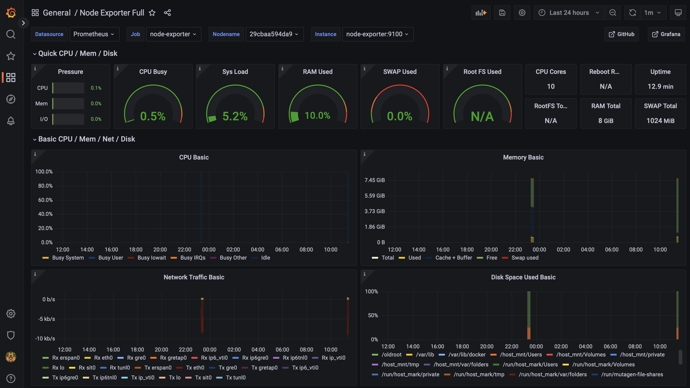

 ```markdown
        
 ```

# My Monitoring Stack

This project provides a lightweight, container-based monitoring stack using Docker Compose. It is designed to be a quick-start solution for monitoring a host system and its running Docker containers.

The stack consists of the following components:
*   **Prometheus:** For collecting and storing metrics.
*   **Grafana:** For visualizing the collected metrics in interactive dashboards.
*   **cAdvisor:** For collecting metrics about running Docker containers.
*   **Node Exporter:** For collecting metrics about the host machine (e.g., CPU, RAM, Network).

## Getting Started 
1. **Clone the repository**
   ```bash
    git clone https://github.com/GreenPiPizi/my-monitoring-stack.git
    cd my-monitoring-stack
   ```

2. **Start the stack**
    ```bash
    docker-compose up -d
    ```

## Accessing the Services

Once the stack is running, you can access the services in your browser:

*   **Prometheus:** [http://localhost:9090](http://localhost:9090)
*   **Grafana:** [http://localhost:3000](http://localhost:3000)
    *   Default Login: `admin` / `admin`
*   **cAdvisor:** [http://localhost:8080](http://localhost:8080)
*   **Node Exporter:** [http://localhost:9100/metrics](http://localhost:9100/metrics)

## ⚙️ Setting up Grafana

After logging into Grafana for the first time, you need to add Prometheus as a data source.


1.  Navigate to `Configuration -> Data Sources`.
2.  Click `Add data source`.
3.  Select `Prometheus`.
4.  Set the **URL** to `http://prometheus:9090`. (This works because all services are in the same Docker network).
5.  Click `Save & Test`.


Now you can import pre-made dashboards or create your own! A good dashboard to start with for Node Exporter is [Node Exporter Full (ID: 1860)]